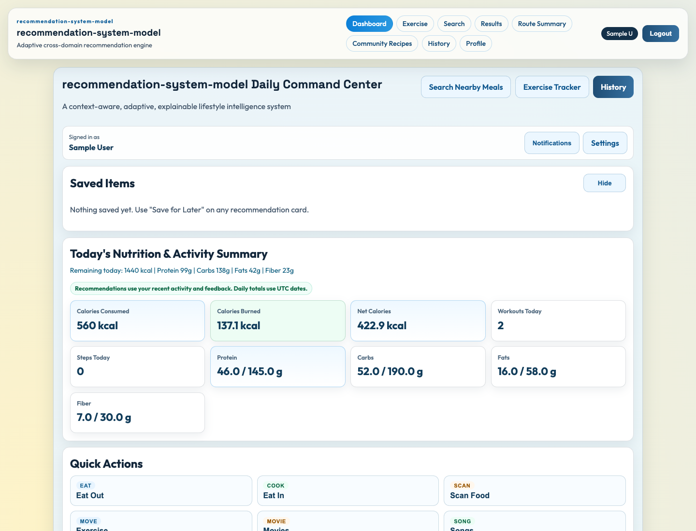
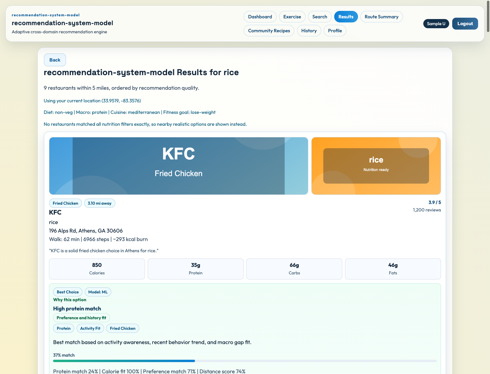

# recommendation-system-model

This is a local full-stack recommendation system built with a React frontend and a Node.js backend. It recommends food, fitness, and media options, stores user feedback, and uses that feedback to adjust future food recommendations.

The application is intentionally lightweight. It uses practical scoring, feedback history, fallback data, and simple cross-domain signals so it can run reliably on a laptop. A separate offline PyTorch experiment trains a small Neural Collaborative Filtering (NCF) baseline on MovieLens; it does not serve recommendations in the app.

## System Nature

The live application uses lightweight adaptive logic rather than the offline neural recommender. The main goal is to keep the behavior explainable, stable, and easy to demo while still showing how feedback can influence future recommendations.

Most live ranking is heuristic. `mlModelService` also contains small logistic-regression training and online-update routines. A card labelled `Model: ML` refers to this application scoring path, not the offline PyTorch NCF model. Match percentages are scoring indicators, not calibrated probabilities of user satisfaction.

## Current Status

- React frontend is working.
- Node.js backend is working.
- Dashboard, search, food recommendations, content recommendations, and feedback APIs are connected.
- Food recommendations use rule-based scoring with adaptive feedback signals.
- Cross-domain logic is implemented in a simple form, mainly fitness-to-food and food-to-fitness signals.
- Local file storage is used when MongoDB is not configured.

## Main Features

- Dashboard summary for calories, meals, activity, recommendations, and media suggestions
- Food and restaurant search with safe fallback data
- Food recommendation endpoint with ranked results
- Feedback actions such as selected, save, helpful, ignored, and not interested
- Adaptive scoring based on recent feedback and stored interaction history
- Lightweight cross-domain mapping between food and fitness
- Media recommendations for eating, walking, and workout contexts
- Safe error responses for invalid input, oversized text, script-like input, and malformed JSON

## System Capabilities

- Adaptive recommendation behavior based on user feedback
- Cross-domain influence between food and fitness
- Multi-option recommendation output with diversity filtering
- Robust input validation and safe API handling
- Lightweight security hardening aligned with OWASP basics

The live application is designed as an explainable and practical prototype, separate from the trained research models.

## Research Infrastructure

The project has a small foundation for offline recommendation experiments:

- Canonical interaction rows with `userId`, domain-aware `itemId`, `domain`, `action`, `timestamp`, and `context`
- Shared feedback-action signals for `selected`, `save`, `helpful`, `ignored`, and `not_interested`
- Deterministic temporal train / validation / test splitting
- Domain-aware negative sampling for future user-item training pairs
- Ranking metrics for Precision@K, Recall@K, and nDCG@K

The offline [NCF experiment](research/README.md) compares Most Popular with a trainable NeuMF baseline. It reuses the JavaScript normalization, temporal splitting, and ranking metrics. The application still uses the existing heuristic recommender.

A separate [three-domain NeuMF experiment](research/MULTIDOMAIN.md) now uses shared Amazon reviewer IDs across Grocery, Sports & Outdoors, and Movies & TV. These are product preferences, not nutrition, workout or streaming behavior. The source audit and fixed pilot cohort are documented separately from the live app. Existing MovieLens results are unchanged.

## Architecture And Modules

The application and research share data conventions, but have separate execution paths:

```text
React -> Express controllers -> candidates -> scoring/context adjustments
      -> feedback-aware reranking -> diverse options -> response
User actions -> stored feedback -> later recommendations

MovieLens -> temporal split/train-only mappings -> NeuMF training
         -> context/adaptive replay comparisons -> ranking evaluation
```

Application responsibilities:

- `restaurantProviderService`: shared OSM/Google restaurant discovery, caching, deduplication and local fallback.
- `candidateGenerationService`: food and media candidate pools, including fallbacks.
- `recommendationScoringService`: nutrition, preference, cross-domain and feedback fit.
- `recommendationService`: restaurant ranking pipeline and explanation assembly.
- `feedbackStorageService` / `feedbackLearningService`: persist actions and build preference affinities.
- `banditDecisionService`: immediate/delayed-proxy blending and limited deterministic exploration.
- `crossDomainMappingService` / `crossDomainSequenceService`: food, fitness and activity-context rules.
- `multiCandidateService`: multiple candidate modes and diversity selection, not a trained TimeMCL model.
- `mlModelService`: small application logistic models; `mlService`: heuristic weighting helpers.
- `frontend/src/utils/recommendationDisplay.js`: shared tags, score display and short explanations.

Offline responsibilities:

- `research/data.py` and `foundation.cjs`: MovieLens preparation, temporal splitting and shared JS metrics.
- `research/model.py`, `train.py`, `evaluate.py`: NeuMF, training and full-catalog ranking evaluation.
- `research/context.py`: cyclic UTC hour and weekday features.
- `research/adaptive.py`: predict-then-update replay, changing only the current user's embeddings.
- `research/compare_*.py`: paired baseline, context and adaptation comparisons.
- `research/test_*.py`: reproducibility, timestamp safety and parameter-isolation tests.

There is no live Python inference endpoint. Learned cross-domain representations remain future work.

## Application Restaurant Data

Restaurant search, dashboard suggestions and food candidates share one provider service. With no key, it requests nearby OpenStreetMap places through Overpass. A configured Google Places key uses the existing Google path instead. The local Athens catalog is fallback/demo data, not live discovery. Results identify the source.

These providers supply restaurant locations and available place metadata, not verified dishes or nutrition. The app's nutrition, ingredients and example images remain illustrative. MovieLens is separate historical research data; it does not supply these restaurant results.

Not Interested suppresses the exact restaurant for seven days before top-K selection. Repeated dislikes extend this to at most 30 days. A later Select, Save or Helpful action clears suppression, but older feedback can still affect its score. The Results page automatically requests replacements after a dislike; Refresh Recommendations also reruns the original search. Feedback is user-specific. IDs are stable within a provider, but feedback is not automatically transferred between OSM, Google and fallback versions of a business.

See [restaurant data and verification notes](docs/RESTAURANT_DATA.md) for provider counts, three live feedback examples, configuration and limitations.

## Dataset And NCF Baseline

The original neural baseline experiments use **MovieLens 100K**, from GroupLens Research at the University of Minnesota: 100,000 ratings, 943 users, 1,682 movies, ratings from 1 to 5, and timestamps. The basic NCF experiment treats ratings of 4 or 5 as positive interactions.

I used MovieLens because it is a standard recommendation benchmark with consistent user/item IDs and timestamps. Its size makes repeated CPU experiments manageable. Food.com and FitRec/EndoMondo have not been used for the current results; they are possible future data sources, not linked-user evidence.

The frozen Amazon V1 experiment uses 1,000 shared reviewer IDs from three product categories; the later V2 cohort expands this to 2,500. One V2 Model C/Balanced seed-42 feasibility run completed, with low ranking scores and substantial cold-item exclusions. Its cohort differs from V1, so it is not evidence of a performance improvement. See the [V1 experiments](research/MULTIDOMAIN.md#seed-42-pilot-results) and the [V2 coverage and pilot report](research/COVERAGE_COHORT.md). Neither experiment is comparable with the MovieLens table below.

NeuMF combines a GMF branch (elementwise user/item embedding products) with an MLP branch (concatenated embeddings). Their outputs produce a ranking logit. Training uses binary cross-entropy on positive and sampled-unobserved interactions, not star-rating prediction. See the [research README](research/README.md) for the dataset source, model details, commands and complete protocols.

## Current Research Results

Original full-period evaluation, seed 42, K=10:

| Model | Precision@10 | Recall@10 | nDCG@10 |
| --- | ---: | ---: | ---: |
| Most Popular | 0.112000 | 0.070971 | 0.128546 |
| NCF / NeuMF | 0.120000 | 0.086811 | 0.155563 |

NCF is the clearest trained baseline result: it beats Most Popular on all three metrics under the same protocol. This evaluation covers only 50 warm test users and 864 of 8,307 test positives, not the full dataset. The original negative-sampling mask excludes held-out positive item identities; this is disclosed offline information, not a strictly history-only simulation.

Temporal context gave mixed results across three seeds: mean precision and nDCG increased slightly, but recall decreased. Offline adaptive NCF genuinely changes user embeddings and rankings, yet aggregate predictive improvement is mixed.

The later four-arm replay uses a different, train-only-negative protocol. Its mean nDCG@10 is 0.054035 (static NCF), 0.054255 (adaptive NCF), 0.054659 (static context), and 0.054425 (adaptive context). Static context has the highest mean, but the small cohort and three seeds do not establish a general winner. Combining context and adaptation is not supported as the default best model. **Do not compare these replay numbers directly with the full-period table.**

Frozen run artifacts remain local in ignored `research/runs/`; the research README retains run IDs, coverage, per-seed tables and limitations. This final application pass did not retrain or overwrite those experiments.

## Project Structure

- `backend/src/controllers`: request handlers for each API area
- `backend/src/services`: application logic for recommendations, search, dashboard data, feedback, and content
- `backend/src/models`: MongoDB/file datastore access
- `backend/src/research`: small utilities for dataset normalization, splitting, negative sampling, and ranking metrics
- `backend/src/routes`: Express route definitions
- `backend/src/middleware`: auth, validation, logging, upload, and error handling
- `backend/src/utils`: shared helpers
- `backend/src/scripts`: small project scripts, including adaptive validation generation
- `backend/src/validation`: final report validation logic
- `research`: offline MovieLens experiments, Amazon data audit/pilot, PyTorch models, evaluation and tests
- `research/results`: small Amazon audit summaries, manifests and pilot metrics
- `data`: local raw/processed datasets, including Amazon category files; ignored by Git
- `frontend`: React app, pages, components, hooks, and API clients
- `results`: generated validation outputs used for report support
- `docs/screenshots`: selected screenshots from the application walkthrough

## Tech Stack

React 19, React Router, Vite and plain CSS; Node.js/Express with optional MongoDB or a local JSON datastore; Python, PyTorch and NumPy for offline experiments. Microsoft Recommenders is not an installed runtime dependency.

## Research Integration (Practical Adaptation)

The project uses recent recommender-system research as guidance, but it does not reproduce those systems. The ideas were simplified into small backend services that fit the current project size:

- Spotify Impatient Bandits: adapted as feedback-based reranking with immediate feedback and a delayed reward proxy. This is not full bandit optimization.
- SyNCRec / cross-domain sequential recommendation: the live application uses rule-based fitness-to-food and food-to-fitness influence. The separate Amazon shared-user NeuMF pilot is neural, but does not implement SyNCRec's sequential architecture.
- TimeMCL: represented as a practical multi-output idea, where the system returns a small diverse set of recommendations. It is not the TimeMCL model.
- Microsoft Recommenders: used as inspiration for candidate generation, scoring, ranking, and validation. The project does not directly integrate the Microsoft library.
- CRSLab: used as inspiration for storing interactions and building feedback profiles. It is not a conversational recommender system.

These are lightweight adaptations for a Master's project demo. They are heuristic and explainable, not full research reproductions.

## Run The Project

Use Node 22.12+ for the current Vite version. Install from the committed lockfiles in two terminals.

Backend:

```bash
cd backend
npm ci
npm start
```

Frontend:

```bash
cd frontend
npm ci
npm run dev
```

Default URLs:

- Backend: `http://localhost:5001`
- Frontend: `http://localhost:5173`

## Demo Login

Use this account for a quick demo:

- `user@bfit.com`
- `user123`

The demo admin is `admin@bfit.com` / `admin123`. Seeded credentials are for local demonstrations only. Do not deploy these accounts publicly.

## Backend Settings

Use `backend/.env.example` as a starting point if needed. Set `FALLBACK_MODE=false` when copying it so API failures are not hidden by the optional demo fallback mode.

Useful local values:

- `PORT=5001`
- `FALLBACK_MODE=false`
- `MONGODB_URI=` can stay empty to use local file storage
- `GOOGLE_API_KEY=` is optional; without it, restaurant discovery uses OSM/Overpass
- `RESTAURANT_PROVIDER=auto`; use `local` for an offline demo or `osm` to select OSM explicitly
- `OVERPASS_URL=https://overpass-api.de/api/interpreter`

The default file store is `backend/runtime-data/store.json` when started from `backend`. `DATASTORE_PATH=/absolute/path/to/store.json npm start` can point a demo at a temporary copy. Do not run two backend processes against the same JSON file. Set a private JWT secret and review demo seeding before deployment. Frontend API configuration is described in `frontend/.env.example`.

## Tests And Validation

Backend syntax check:

```bash
cd backend
find src test -name "*.js" -print0 | xargs -0 -n1 node --check
```

Backend API tests:

```bash
cd backend
npm test
```

Frontend checks:

```bash
cd frontend
npm run lint
npm run build
```

The backend tests cover dashboard, search, food recommendations, food feedback, invalid input, malformed JSON, script-like text input, oversized search text, missing auth, and lightweight rate limiting.

Research checks, from the root after the setup in `research/README.md`:

```bash
research/.venv/bin/python -m unittest discover -s research -p 'test_*.py'
research/.venv/bin/python -m compileall -q research -x '/(\.venv|runs)/'
```

September 30 pre-commit checks: 29 backend tests and 21 Python tests passed; frontend lint/build and backend syntax checks passed. Restaurant regressions cover exact dislikes, suppression duration, later positive actions, user isolation, legacy and case-sensitive IDs, zero affinity, provider normalization, deduplication, cached illustrations, location validation and timeout fallback. Google uses a mocked response in tests; no paid Google account was tested. The installed Node 20.12.2 produced a Vite version warning. Test fixtures train tiny synthetic models in temporary directories, not the frozen MovieLens experiments.

## Adaptive Validation

The repo includes a small repeatable experiment for the final report. It creates three validation users, simulates feedback through the existing food feedback service, and writes before/after recommendation results.

The validation users are:

- Strength / High Protein: muscle-gain goal, strength workout pattern, and positive feedback for protein/recovery meals.
- Cardio / Low Calorie: endurance or weight-control goal, cardio activity, and positive feedback for lighter meals.
- Mixed / Cheat Meal Pattern: balanced goal, irregular workouts, mixed food behavior, and negative feedback for disliked items.

```bash
cd backend
npm run validate:adaptive
```

Generated files:

- `results/adaptive_results.json`
- `results/cross_domain_results.json`
- `results/multi_output_results.json`
- `results/adaptive_summary.txt`

Admin users can also read the latest summary from `GET /api/admin/adaptive-summary`. This is a validation aid, not a separate recommendation model.

The generator writes result files and validation users. Use a temporary datastore and a separate working copy when regenerating; existing report outputs were preserved during this pass.

The earlier [walkthrough](docs/VERIFICATION.md) recorded Your Pie moving from rank 2 to 1 and Taqueria Tsunami from 3 to 8. The current restaurant pass strengthens explicit dislikes to temporary suppression. In a live OSM search, Lighthouse Seafood, Ponko Chicken and Dairy Queen started at ranks 1, 2 and 3; each disappeared from fresh searches after Not Interested. Saving Dairy Queen later restored it at rank 1. These are application feedback effects, not results from the offline NCF model. Reloading Results alone retains its saved snapshot; use Refresh Recommendations for a new server ranking.

## Screenshots

Captured with the documented demo account and a temporary datastore. Restaurant images and nutrition shown in fallback mode are sample estimates, not verified menus.




Also available: [explanation and feedback controls after feedback](docs/screenshots/03-explainable-ranking.png) and [eating/walking media](docs/screenshots/05-cross-domain.png). The explanation capture includes the feedback buttons, so a separate duplicate image is not included.

## Security Considerations

The backend includes a small security layer for the demo:

- request body and query validation on the main API routes
- basic sanitization for normal text inputs
- limits for oversized search input
- safe error responses without stack traces
- request logging with a request id, timestamp, status code, and duration
- basic security headers for common browser protections
- lightweight in-memory rate limiting for repeated requests
- atomic JSON datastore writes with recovery if local JSON becomes corrupted

This is a local student-project security baseline, not production hardening. Rate limits are per-process and reset on restart. Atomic file replacement protects against partial writes, but is not a multi-process database or a backup strategy. Demo seeding, password-reset delivery, JWT configuration, HTTPS and deployment-specific headers need review before public use.

## Known Limitations

- The adaptive logic is lightweight and heuristic-based.
- The offline NCF baseline is not connected to the application. The live recommender remains mostly heuristic and partially adaptive.
- The research components are practical adaptations, not complete implementations of the cited methods.
- MongoDB is optional; local file storage is the easiest demo mode.
- OSM/Overpass availability varies. A failed request uses the labelled local catalog; an empty successful response stays empty. Cold requests can take several seconds.
- OSM and Google records do not establish menu availability, nutrition accuracy or cross-provider business identity. Multiple branches of one chain can appear as separate places.
- The backend has useful API tests, but the frontend does not yet have automated UI tests.
- Daily totals/calendar keys use UTC, while entry timestamps display in the browser's local time.
- Ranking includes diversity and exploration, so order need not follow displayed match percentages exactly.
- Cuisine/source preferences and overall feedback history can affect other scores, but exact-item suppression applies only to the matched restaurant ID or its legacy alias. This is not precise personal taste inference.
- A fallback dashboard is explicitly labelled when live requests fail; it is not measured user activity.
- Nutrition, travel calories and fitness suggestions are estimates, not medical advice. Media lists include curated sources and shows as well as movies; external playback is not hosted here.
- Offline results have limited warm-user coverage. MovieLens ratings are not randomized exposures or linked food/fitness histories.

## Future Work

- Add browser regression tests for search feedback and daily totals.
- Evaluate more users and temporal splits before choosing a context/adaptation model.
- Obtain ethically usable, genuinely linked-user cross-domain data before implementing learned transfer.
- Improve real food/media metadata and production authentication before a public demo.
- Keep live NCF integration and conversational recommendation as separate future work, not current capabilities.
